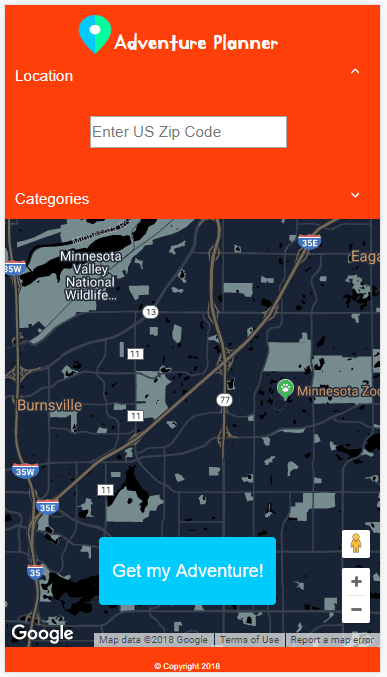

# <a href="https://writesandy.github.io/Adventure-App/</a>">Adventure-App</a>
 
Enter your city or zipcode into the Adventure App for things to do today on TicketMaster.  

# APIS USED
- `Google Geocode API`
- `Google Places`
- `Google Maps`
- `Ticketmaster Event Finder` 
  

# App Description 

A map  will appear on the page. Once the user enters their zipcode or hits enter,  they will see markers appear on the map
The markers will have an event appear, an image of the event, the name of the event, with an embedded link to buy tickets at that venue.
 
This app was coded by a group of friends that wanted to get more comfortable with using Google Api's. This app showcases the Google and Ticketmaster Api's.

# Screenshots

